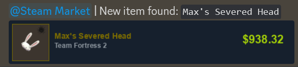

# Steam Market Notifier
A simple script that notifies you when a new item is listed on the Steam Market. 

## Features
* Search for items by name (including descriptions)
* Filters by ascending prices
* Generates an image of the item
* Sends a notification to Discord with the item's name, price, and image
* Stores already seen items in a json file

## Requirements
* Python 3.6+
* [Requests](http://docs.python-requests.org/en/master/)
* [Pillow](https://pillow.readthedocs.io/en/stable/)
* [Discohook](https://github.com/Janakthegamer/Discohook)

## Usage
1. Install the requirements ([Arialbd.ttf](https://fontsfree.net/arial-bold-font-download.html) is required for the image generation])
2. Create a Discord webhook
3. Edit the config.py file
4. Run the script
> **Note:**
> This script is meant to be run with a scheduler like [Cron](https://en.wikipedia.org/wiki/Cron) or [Task Scheduler](https://en.wikipedia.org/wiki/Windows_Task_Scheduler) to check for new items periodically.

## License
This project is licensed under the MIT License - see the [LICENSE](LICENSE) file for details

## Extra
This script was made for my own personal use, but I decided to share it in case anyone else wanted to use it.
There is some code included in ``draw_image.py`` that allows you to generate an image with all the items that were found.
This is useful if you want to see all the items that were found in a single image, but it is not necessary for the script to work.

## Disclaimer
This script is not affiliated with Valve or Steam in any way. It is not meant to be used for any malicious purposes. Use at your own risk.